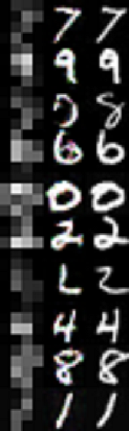

# DCGANs for Image Enhancement
Metis Project #5 - Deep convolutional generative adversarial networks for image enhancement  

For a general overview of GANs, see [this](Generative%20Adversarial%20Networks.pdf) presentation.  
[This](https://github.com/K-Du/Generative-Adversarial-Network/blob/master/Image%20Enhancement%20Using%20Deep%20Learning.pdf) presentation gives a brief non-technical summary of this project.

The GAN is based on David Garcia's [code](https://github.com/david-gpu/srez) for specifically enhancing celebrity photos.
I added some extra features and enabled it to be used for any imageset (such as MNIST digits).

### Updates
- Now supports Tensorflow 1.0
- Added a separate script for testing/inference
- Added tanh layer for last generator layer
- Added Dropout layers to generator
- Changed ReLU layers to leaky ReLU by default
- Added flags to allow a different learning rate and Adam beta parameter for generator and discriminator
- Training output now displays both L1 generator loss and cross-entropy generator loss
- Added option to adjust ratio of how heavily the discriminator loss depends on real loss and fake loss (default 1:1)
- Added option to replace the L1 norm with L2 for calculating generator loss

### Dependencies
- Python  
- Tensorflow 1.0  
- scipy  
- numpy  
- moviepy (optional for creating demo)

### Instructions
- Download all the .py files. 
- Create a folder called "dataset" and place all of the images in it. Images must be in jpeg format and square. 
- (Optional) Run [image_verify.py](image_verify.py) to ensure image files are formatted correctly and not corrupted.  
- From a console, run `python srez_main.py` to start training. Results will be automatically stored in a folder called "train", checkpoints will be automatically stored in a folder called "checkpoint".
- By default, the batch size is set to 16 and training will stop after 20 minutes. These and many more settings (see srez_main.py) can be adjusted by appending flags when running the python script.  
For example: `python srez_main.py --batch_size 32 --train_time 60`  
- To run inference: Run the command python srez_test.py --max_samples 10 to test 10 images together

### Troubleshooting
- When using this on CPU (not recommended), training time must be set higher or no results will be saved.
- Depending on image size, [srez_input.py](srez_input.py) crop_size and image_size variables might need to be edited. Batch size should be lowered if memory becomes an issue with larger images.
- GANs are very difficult to train and it is common to see divergence where the discriminator loss goes to zero while the generator loss increases. Some excellent tips and tricks for training GANs can be found here: https://github.com/soumith/ganhacks

[References](References.md)

