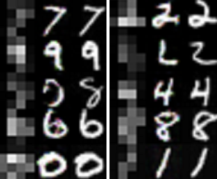

# DCGANs for Image Enhancement
Metis Project #5 - Deep convolutional generative adversarial networks for image enhancement  

For a general overview of GANs, see [this](Generative%20Adversarial%20Networks.pdf) presentation.  
[This](https://github.com/K-Du/Generative-Adversarial-Network/blob/master/Image%20Enhancement%20Using%20Deep%20Learning.pdf) presentation gives a brief non-technical summary of this project.

The GAN is based on David Garcia's [code](https://github.com/david-gpu/srez) for specifically enhancing celebrity photos.
I added some extra features and enabled it to be used for any imageset (such as MNIST digits).

(In Progress: Updating for Tensorflow 1.0)

### Dependencies
Python
Tensorflow 1.0
scipy
numpy
moviepy (optional for creating demo)

### Instructions:
- Download the five .py files. 
- Create a folder called "dataset" and place all of the images in it. Images must be in jpeg format. 
- From a console, run `python srez_main.py` to start training. Results will be automatically stored in a folder called "train", checkpoints will be automatically stored in a folder called "checkpoint".
- By default, the batch size is set to 16 and training will stop after 20 minutes. These and many more settings (see srez_main.py) can be adjusted by appending flags when running the python script.  
For example: `python srez_main.py --batch_size 32 --train_time 60`

To-do:
- Enable a pure black-and-white mode to increase training speed
- Automatically detect objects in a large image and crop out the background

[References](References.md)

